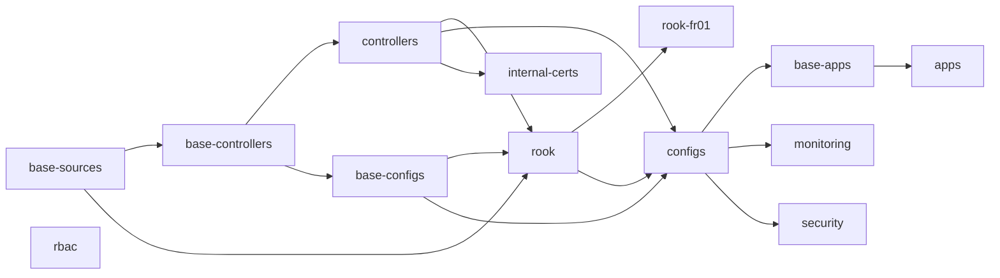

# Kubernetes Cluster Management

[](https://github.com/OneLiteFeatherNET/Kubernetes-FLUX/actions/workflows/flux-validate.yaml)
[](https://github.com/OneLiteFeatherNET/Kubernetes-FLUX/actions/workflows/sbom-scan.yaml)
[](https://docs.renovatebot.com/)

GitOps configuration for OneLiteFeather's Kubernetes cluster **`feather-core`** — ten
control-plane, storage and worker nodes running Talos. There is no application source code
here, only manifests: Flux `Kustomization`s, Helm values, Kustomize overlays and a handful
of in-repo charts.

> **Operational documentation lives in Outline**, under
> [Infrastruktur → Kubernetes-FLUX](https://outline.onelitefeather.dev/doc/kubernetes-flux-gitops-fur-feather-core-x27ljhcgMA).
> That is where the *why* belongs — in particular
> [Betriebsfallen](https://outline.onelitefeather.dev/doc/betriebsfallen-im-feather-core-cluster-qgL9Dgd4Ra),
> the behaviours that are not visible in the manifests and that mostly cost an outage to
> learn. Comments in this repository stay short and point there.

The cluster reconciles itself against `main`. A change takes effect **only once it is
merged**, after which Flux picks it up — the Git source is polled every minute, the root
Kustomization every ten.

## Repository layout

| Path | What lives here |
|---|---|
| `clusters/feather-core/` | The Flux control plane. `flux-system/` is the bootstrap; every other `*.yaml` is one Flux `Kustomization` — a layer. |
| `infrastructure/` | Cluster plumbing: Flux sources, controllers and operators, and configs (databases, storage, PKI). |
| `apps/` | The actual workloads. |
| `helm/` | Charts maintained in this repo: `outline`, `shlink`, and `micronaut` — the generic chart several Micronaut services share. |
| `scripts/` | Validation and SBOM tooling, all of it also run by CI. |

Everything follows a **base + overlay** pattern: `*/base/<name>/` holds the portable
definition, `*/clusters/feather-core/<layer>/<name>/` patches it for this cluster and
attaches its secrets.

> **Watch the spelling.** Infrastructure lives under `clusters/feather-core/`, apps under
> `clusters/feathre-core/` — the typo is real, load-bearing and present in both Flux
> Kustomizations. Do not "fix" one to match the other.

## Layer order

Layers depend on each other, and most wait for their dependencies to report healthy before
they start. A layer therefore blocks everything downstream of it while it settles.



`base-sources` and `rbac` have no dependencies and start immediately. All layers decrypt
SOPS secrets through the `sops` provider, except `internal-certs`.

## Working on this repository

```bash
# Validate everything the way CI does: kustomize build every Flux path, then kubeconform.
./scripts/validate.sh

# Render a single overlay while iterating.
kubectl kustomize infrastructure/clusters/feather-core/controllers/<name>

# Apply a merged change now instead of waiting for the poll interval.
flux reconcile kustomization <layer> --with-source
flux get kustomizations -A
```

Do not loop `flux reconcile`. Forcing a layer mid-flight flips it back to `Reconciling`,
which makes every dependent report "dependency not ready" — you create the churn you were
trying to clear.

Two things bite regularly:

- **Bump `version:` in `Chart.yaml` when you edit a chart under `helm/`.** Helm caches by
  chart version; without a bump your template edits never reach the cluster.
- **Changing a secret's contents does not restart anything.** Overlays set
  `disableNameSuffixHash: true`, so the generated `Secret` name stays the same and no
  rollout is triggered. Restart the consumer yourself.

## Secrets

Secrets are encrypted whole-file with [SOPS](https://github.com/getsops/sops) and age. The
full workflow is in [`docs/sops.md`](docs/sops.md); the essentials:

- Recipients live in exactly one place: `.sops.yaml` at the repo root, holding three age
  public keys — maintainer, cluster and CI.
- Encrypted suffixes are `*.sops.{env,yaml,json,crt,key,conf}` **and plain `*.env`**. There
  is deliberately no rule for plain `*.yaml`, so `sops -e` on one fails closed. Name a
  Secret manifest `*.sops.yaml`.
- Edit in place with `sops <file>`. After changing recipients, re-encrypt everything with
  `./scripts/rekey.sh`.

> `.sops.yaml` and the ciphertext must move in the **same commit**. A file that is validly
> encrypted but missing the cluster's key breaks every Flux layer that touches it.
> `scripts/check-sops-encryption.py` enforces this in CI — run it locally after any
> recipient change.

## Supply-chain scanning

Two scanners run against the same images from two directions, because neither sees
everything on its own.

**In the cluster.** [trivy-operator](https://github.com/aquasecurity/trivy-operator) runs in
the `security` layer and scans what is actually running — roughly 103 images — producing
`VulnerabilityReport`s, `ConfigAuditReport`s, RBAC assessments and CycloneDX
`SBOMReport`s. It runs in ClientServer mode against an in-cluster `trivy-server`; standalone
mode deadlocks on the shared DB lock for multi-container pods.

**In CI.** The [`sbom-scan`](.github/workflows/sbom-scan.yaml) workflow scans every image
this repository *pins* — 27 today — and pushes their SBOMs to
[Dependency-Track](https://dependencytrack.org/). It runs nightly, on every push to `main`
that touches a manifest, and on demand. What a chart resolves on its own is invisible to CI
by definition — that gap is exactly what the in-cluster operator covers.

```bash
# Which images can CI see, and where is each pinned?
scripts/collect-images.py --stats

# Build an SBOM and rehearse the upload without touching the server.
trivy image --format cyclonedx --scanners license -o sbom/x.cdx.json <image>
scripts/upload-sbom.py --dry-run 'sbom/*.cdx.json'
```

Each image becomes one Dependency-Track project, named after the image repository with the
tag as its version. That is what makes the server compare `v2.15.0` against `v2.15.2`
instead of filing them as unrelated projects.

Dependency-Track and Trivy will not agree on the numbers, and that is expected.
Dependency-Track analyses from OSV, the GitHub Advisory Database and NVD; Trivy uses the
distributions' own security trackers. Dependency-Track therefore reports far more on Go,
npm, PyPI and Maven dependencies — 86 % of what these images contain — while raising
findings on Debian or Photon packages the distribution has long since backported. **For
"did this bump actually reduce anything?", an A/B `trivy image` run is the sharper tool.**

### Enabling the upload

The workflow scans and publishes its SBOMs as artifacts regardless, but skips the upload
with a warning until it has somewhere to send them:

1. In Dependency-Track, under *Administration → Access Management → Teams*, create a team
   with `BOM_UPLOAD`, `PROJECT_CREATION_UPLOAD` and `VIEW_PORTFOLIO`, and generate an API key.
2. Add it to this repository as the secret **`DT_API_KEY`**, and the server URL as the
   variable **`DT_URL`**.

Trivy emits CycloneDX 1.7 with no way to ask for less, while Dependency-Track 4.13 ships
cyclonedx-core-java 11.x and rejects anything past 1.6. `scripts/upload-sbom.py` rewrites
each document before upload — it drops the spec version and moves license IDs the 1.6 SPDX
enum does not know from `license.id` to `license.name`. Both steps are lossless for what
Dependency-Track analyses, and the rewrite becomes a harmless no-op once the server reaches
4.14.

## Conventions

- **Conventional Commits are enforced.** Allowed types are
  `build|chore|ci|docs|feat|fix|perf|refactor|revert|style|test`; the subject starts
  lowercase and the header stays under 100 characters. The PR title is linted too, because
  it becomes the squash-merge subject.
- **CI runs `scripts/validate.sh` on every PR** touching `clusters`, `infrastructure`,
  `apps` or `helm`. Run it locally first.
- **Renovate opens the version bumps.** It watches the Flux `HelmRelease` chart versions and
  the image tags pinned in overlays and `helm/*/values.yaml`, and merges patch updates on
  its own once CI is green. Expect `main` to move under you — rebase before pushing.

## Tooling

[Flux](https://fluxcd.io/) · [Kustomize](https://kustomize.io/) ·
[Helm](https://helm.sh/) · [SOPS](https://github.com/getsops/sops) ·
[Trivy](https://trivy.dev/) · [Dependency-Track](https://dependencytrack.org/) ·
[Renovate](https://docs.renovatebot.com/)
