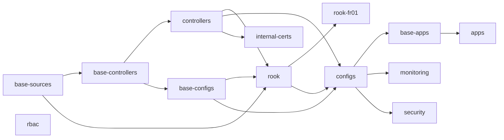

# Kubernetes-FLUX

[](https://github.com/OneLiteFeatherNET/Kubernetes-FLUX/actions/workflows/flux-validate.yaml)
[](https://github.com/OneLiteFeatherNET/Kubernetes-FLUX/actions/workflows/sbom-scan.yaml)
[](https://docs.renovatebot.com/)

The desired state of OneLiteFeather's Kubernetes cluster **`feather-core`**, as code.

This repository holds no application source — only Kubernetes configuration: Flux
`Kustomization`s, Kustomize overlays, Helm values, and a few charts maintained here. The cluster
continuously reconciles itself against `main`, so a change takes effect once it is merged, not
when it is applied by hand.

> **Documentation lives in Outline**, under
> [Infrastruktur → Kubernetes-FLUX](https://outline.onelitefeather.dev/doc/kubernetes-flux-gitops-fur-feather-core-x27ljhcgMA)
> — architecture, runbooks, secrets handling, incidents and the operational knowledge that is not
> visible in the manifests.

## Layout

| Path | Contents |
|---|---|
| `clusters/feather-core/` | The Flux control plane. Each file here is one `Kustomization` — a layer. |
| `infrastructure/` | Cluster plumbing: Flux sources, controllers and operators, and configs (databases, storage, PKI). |
| `apps/` | The workloads. |
| `helm/` | Charts maintained in this repository: `outline`, `shlink`, `vikunja`, and `micronaut` — the generic chart several Micronaut services share. |
| `scripts/` | Validation and SBOM tooling, all of it also run by CI. |

Everything follows a **base + overlay** pattern: `*/base/<name>/` holds the portable definition,
`*/clusters/feather-core/<layer>/<name>/` patches it for this cluster and attaches its secrets.

## Layer dependencies

Layers depend on each other, and most wait for their dependencies to report healthy before they
start — so a layer blocks everything downstream of it while it settles.



`base-sources` and `rbac` have no dependencies and start immediately.

## Working here

```bash
# Validate everything the way CI does.
./scripts/validate.sh

# Render a single overlay while iterating.
kubectl kustomize infrastructure/clusters/feather-core/controllers/<name>

# Inspect the cluster's view of this repository.
flux get kustomizations -A
```

Commits follow [Conventional Commits](https://www.conventionalcommits.org/); CI lints both the
commits and the pull-request title. Renovate opens the version bumps.

Conventions, pitfalls and the reasoning behind the layout are documented in Outline — start at the
[repository overview](https://outline.onelitefeather.dev/doc/kubernetes-flux-gitops-fur-feather-core-x27ljhcgMA).

## Tooling

[Flux](https://fluxcd.io/) · [Kustomize](https://kustomize.io/) · [Helm](https://helm.sh/) ·
[SOPS](https://github.com/getsops/sops) · [Trivy](https://trivy.dev/) ·
[Dependency-Track](https://dependencytrack.org/) · [Renovate](https://docs.renovatebot.com/)
